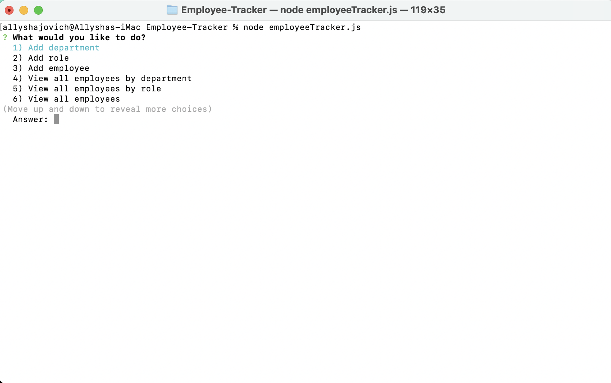

# Employee-Tracker

## Description

* A Content Management System that allows the user to view and manage departments, roles, and employees within their company. 

* A command line application where non-developers are able to view and manage their company information stored within a database. 

* This application utilizes: node, inquirer, console.table and MySQL.

## Goals

* The user is able to:

    * Add departments, roles, and employees

    * View departments, roles, and employees

    * Update employee roles

## Acceptance Criteria

``
Build a command-line application that at a minimum allows the user to:

  * Add departments, roles, employees

  * View departments, roles, employees

  * Update employee roles

Bonus points if you're able to:

  * Update employee managers

  * View employees by manager

  * Delete departments, roles, and employees

  * View the total utilized budget of a department -- ie the combined salaries of all employees in that department
``

## Usage

* Clone this repository to your local machine, 

* Open the repository from your terminal, 

* Run npm init -y,

* Run npm install,

* Create the employeeTracker_db database in mySQL Workbench, 

* Seed the database using node seed.sql, 

* Run node employeeTracker.js

* Please ensure [NodeJs](https://nodejs.org/en/) is downloaded prior to application use.

* This application utilizes [InquirerJs](https://www.npmjs.com/package/inquirer/v/0.2.3) NPM package.

## Animation & Images

* Click https://drive.google.com/file/d/1toRD_sWxcWoSDou_MK8lBS1R2vZJO_in/view for video demonstration

* 

# MIT License 

Copyright 2021 Allysha Jovich

Permission is hereby granted, free of charge, to any person obtaining a copy of this software and associated documentation files (the "Software"), to deal in the Software without restriction, including without limitation the rights to use, copy, modify, merge, publish, distribute, sublicense, and/or sell copies of the Software, and to permit persons to whom the Software is furnished to do so, subject to the following conditions:

The above copyright notice and this permission notice shall be included in all copies or substantial portions of the Software.

THE SOFTWARE IS PROVIDED "AS IS", WITHOUT WARRANTY OF ANY KIND, EXPRESS OR IMPLIED, INCLUDING BUT NOT LIMITED TO THE WARRANTIES OF MERCHANTABILITY, FITNESS FOR A PARTICULAR PURPOSE AND NONINFRINGEMENT. IN NO EVENT SHALL THE AUTHORS OR COPYRIGHT HOLDERS BE LIABLE FOR ANY CLAIM, DAMAGES OR OTHER LIABILITY, WHETHER IN AN ACTION OF CONTRACT, TORT OR OTHERWISE, ARISING FROM, OUT OF OR IN CONNECTION WITH THE SOFTWARE OR THE USE OR OTHER DEALINGS IN THE SOFTWARE.

## Link to GitHub Repository

* https://github.com/ajovich/Employee-Tracker